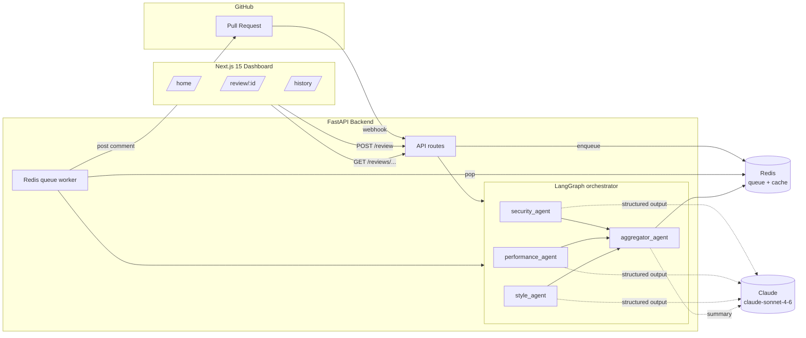

# 🤖 SpectraCode

An AI-powered pull-request reviewer. Three specialized agents — **security**,
**performance**, and **style** — analyze a diff in parallel, a fourth
**aggregator** deduplicates and scores their findings, and the result is posted
back to the PR as a clean markdown review.

Monorepo: a **FastAPI** backend (LangGraph + Claude) and a **Next.js 15**
dashboard, orchestrated with Docker Compose and backed by Redis.

 <!-- TODO: drop a demo GIF here -->

---

## ✨ Features

- **Multi-agent review** — security (SQLi, secrets, insecure deps, XSS),
  performance (N+1, wasteful loops, leaks, blocking I/O), and style (naming,
  function length, duplication, docstrings).
- **Parallel orchestration** — a LangGraph `StateGraph` fans out to all three
  agents at once; if one fails, the others still complete.
- **Scored report** — deduped, severity-ranked issues with a 0–100 score and
  top-5 recommendations.
- **GitHub integration** — webhook-triggered reviews + auto-posted PR comments.
- **Brutalist dashboard** — dark, terminal-flavored UI (Next.js + framer-motion).
- **Zero-setup demo** — `POST /demo` reviews a built-in sample diff.

---

## 🏗️ Architecture



Parallel fan-out / fan-in inside the graph:

```
              ┌──────────────┐
        ┌────►│   security   │────┐
        │     └──────────────┘    │
    ┌───┴──┐  ┌──────────────┐    ▼   ┌────────────┐
    │ START├─►│ performance  ├──►(aggregate)──► END │
    └───┬──┘  └──────────────┘    ▲   └────────────┘
        │     ┌──────────────┐    │
        └────►│    style     │────┘
              └──────────────┘
```

### Layout

```
code-review-agent/
├── backend/
│   ├── agents/          # security, performance, style, aggregator + shared base
│   ├── core/            # orchestrator (LangGraph), github_client, redis, config
│   ├── api/             # FastAPI routes (webhook, review, cache, health, demo)
│   ├── tests/           # pytest, mocked LLM
│   └── main.py          # app + CORS + background worker
├── frontend/            # Next.js 15 (App Router, Tailwind, framer-motion)
│   ├── app/             # / , /review/[id] , /history
│   ├── components/      # ScoreGauge, SeverityBadge, ui atoms
│   └── lib/             # api client, mock data, severity palette
└── docker-compose.yml
```

---

## 🚀 Setup

### With Docker (recommended)

```bash
git clone <repo> code-review-agent && cd code-review-agent
cp .env.example .env          # fill in your keys
docker compose up --build
```

- Dashboard → http://localhost:3000
- API docs  → http://localhost:8000/docs
- Demo it   → `curl -X POST http://localhost:8000/demo`

### Local dev

```bash
# Backend
cd backend
python -m venv .venv && source .venv/bin/activate   # Windows: .venv\Scripts\activate
pip install -r requirements.txt
uvicorn main:app --reload

# Frontend (new terminal)
cd frontend
npm install
npm run dev
```

You'll also need a Redis instance (`docker run -p 6379:6379 redis:7-alpine`).

---

## 🔐 Environment variables

| Variable                | Required | Description                                              |
| ----------------------- | -------- | -------------------------------------------------------- |
| `GROQ_API_KEY`          | yes      | Groq API key used by all review agents.                  |
| `GITHUB_TOKEN`          | yes\*    | PAT (repo + pull_request scopes) for diffs & comments.   |
| `GITHUB_WEBHOOK_SECRET` | yes\*    | Shared secret to verify webhook HMAC-SHA256 signatures.  |
| `REDIS_URL`             | no       | Redis URL (unused locally — app uses in-process fakeredis).|

<sub>\* Not needed for the `/demo` endpoint, which runs on a hardcoded diff.</sub>

---

## 📡 API

| Method | Path                                  | Description                                        |
| ------ | ------------------------------------- | -------------------------------------------------- |
| `GET`  | `/health`                             | Health check.                                      |
| `POST` | `/demo`                               | Review a built-in sample diff — no GitHub needed.  |
| `POST` | `/review`                             | `{repo, pr_number}` → run full review, return report. |
| `POST` | `/webhook/github`                     | GitHub PR webhook; queues `opened`/`synchronize`.  |
| `GET`  | `/reviews`                            | List summaries of all past reviews (history page). |
| `GET`  | `/reviews/{owner}/{repo}/{pr_number}` | Fetch a cached review from Redis.                  |

Report shape:

```json
{
  "summary": "…",
  "total_issues": 4,
  "issues_by_severity": { "critical": 1, "high": 1, "medium": 1, "low": 1 },
  "top_recommendations": ["…"],
  "overall_score": 57,
  "issues": [
    {
      "category": "SQL Injection",
      "severity": "critical",
      "line_number": 14,
      "file": "app/db.py",
      "description": "…",
      "fix_suggestion": "…",
      "agent": "security"
    }
  ]
}
```

---

## 🧪 Tests

```bash
cd backend
pip install -r requirements-dev.txt
pytest
```

Tests mock the LLM (no network/API key needed) and cover each agent, the
aggregator's dedup/scoring, the orchestrator's parallel + failure handling, and
the API routes (including webhook signature verification).

---

## 🧰 Tech stack
<!-- test PR -->
**Backend:** FastAPI · LangGraph · LangChain · langchain-groq
(`llama-3.3-70b-versatile`) · PyGithub · fakeredis · httpx
**Frontend:** Next.js 15 (App Router) · React 19 · Tailwind CSS · framer-motion
**Infra:** Docker Compose · Redis
